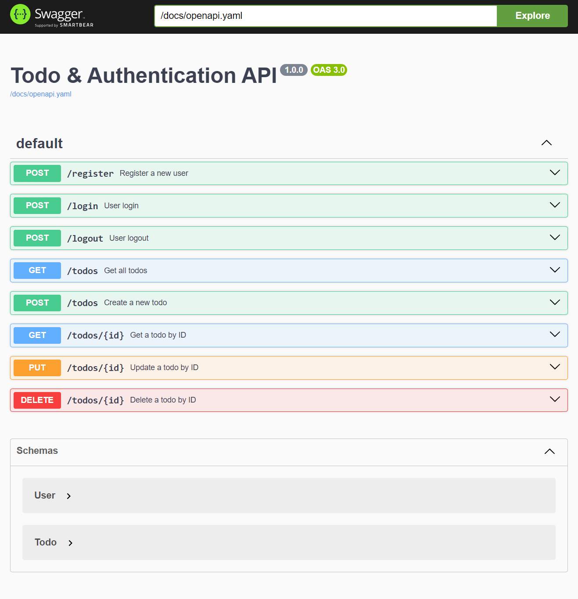

# Go API Starter

This branch includes a starter implementation of an auth API with OpenAPI (Swagger) documentation in Go.

Access other branches to find more implementations of authentication and todo APIs:

- [main](https://github.com/afutofu/go-api-starter): Auth & Todo API with OpenAPI UI
- [rest-auth](https://github.com/afutofu/go-api-starter/tree/rest-auth): Auth API
- [rest-todo](https://github.com/afutofu/go-api-starter/tree/rest-todo): Todo API
- [rest-todo-openapi](https://github.com/afutofu/go-api-starter/tree/rest-todo-openapi): Todo API with OpenAPI UI

## Table of Contents

1. [Features](#features)
1. [Endpoints](#endpoints)
1. [Setup](#setup)
1. [Usage](#usage)
1. [Access OpenAPI](#access-openapi-swagger-ui)
1. [Authors](#authors)

## Features

- User registration
- User login
- User logout
- OpenAPI documentation

## Endpoints

### Authentication

- `POST /register` - Register a new user
- `POST /login` - Login a user
- `POST /logout` - Logout a user

### OpenAPI

- `GET /docs/openapi.yaml` - OpenAPI specification
- `GET /swagger` - Swagger UI

## Setup

1. Clone the repository:

   ```bash
   git clone https://github.com/afutofu/go-api-starter.git
   cd projectname
   git checkout rest-auth-openapi
   ```

2. Install dependencies:

   ```bash
   go mod tidy
   ```

3. Run the server:
   ```bash
   go run main.go
   ```

## Usage

### Authentication

Register a user:

```bash
curl -X POST http://localhost:8000/register -H "Content-Type: application/json" -d '{"username":"testuser", "password":"password123"}'
```

Login:

```bash
curl -X POST http://localhost:8000/login -H "Content-Type: application/json" -d '{"username":"testuser", "password":"password123"}'

```

Logout user:

```bash
curl -X POST http://localhost:8000/register -H "Content-Type: application/json" -d '{"username":"testuser", "password":"password123"}'
```

## Access OpenAPI (Swagger) UI

Navigate to:

```bash
http://localhost:8000/swagger
```



## Authors

- [Afuza](https://github.com/afutofu): Create and maintain repository
