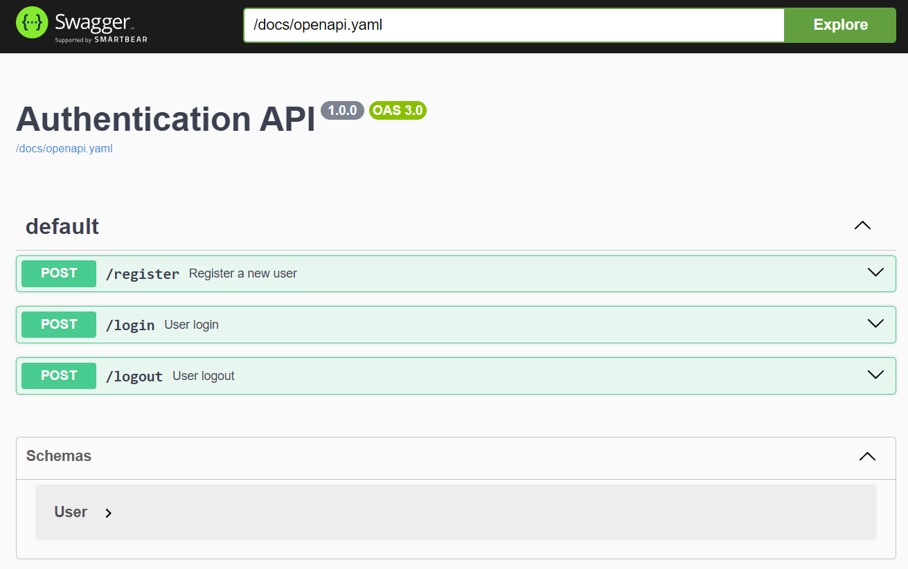

# Go API Starter

This branch includes a starter implementation of a todo API with OpenAPI (Swagger) documentation in Go.

Access other branches to find more modular implementations of authentication and todo APIs:

- [main](https://github.com/afutofu/go-api-starter): Auth & Todo API with OpenAPI UI
- [rest-auth](https://github.com/afutofu/go-api-starter/tree/rest-auth): Auth API
- [rest-todo](https://github.com/afutofu/go-api-starter/tree/rest-todo): Todo API
- [rest-auth-openapi](https://github.com/afutofu/go-api-starter/tree/rest-auth-openapi): Auth API with OpenAPI UI

## Table of Contents

1. [Features](#features)
2. [Setup](#setup)
3. [Usage](#usage)
4. [Access OpenAPI](#access-openapi-swagger-ui)
5. [Authors](#authors)

## Features

- Create a todo
- Get all todos
- Get a todo by ID
- Update a todo by ID
- Delete a todo by ID
- OpenAPI documentation

## Endpoints

### Todo

- `POST /todos` - Create a new todo
- `GET /todos` - Get all todos
- `GET /todos/{id}` - Get a todo by ID
- `PUT /todos/{id}` - Update a todo by ID
- `DELETE /todos/{id}` - Delete a todo by ID

### OpenAPI

- `GET /docs/openapi.yaml` - OpenAPI specification
- `GET /swagger` - Swagger UI

## Setup

1. Clone the repository:

   ```bash
   git clone https://github.com/afutofu/go-api-starter.git
   cd projectname
   git checkout rest-todo-openapi
   ```

2. Install dependencies:

   ```bash
   go mod tidy
   ```

3. Run the server:
   ```bash
   go run main.go
   ```

## Usage

### Todo

Create a Todo:

```bash
curl -X POST http://localhost:8000/todos -H "Content-Type: application/json" -d '{"text":"Test Todo", "completed":false}'
```

Get All Todos:

```bash
curl -X GET http://localhost:8000/todos
```

Get a Todo by ID:

```bash
curl -X GET http://localhost:8000/todos/0
```

Update a Todo by ID:

```bash
curl -X PUT http://localhost:8000/todos/0 -H "Content-Type: application/json" -d '{"text":"Updated Todo", "completed":true}'
```

Delete a Todo by ID:

```bash
curl -X DELETE http://localhost:8000/todos/0
```

## Access OpenAPI (Swagger) UI

Navigate to:

```bash
http://localhost:8000/swagger
```



## Authors

- [Afuza](https://github.com/afutofu): Create and maintain repository
